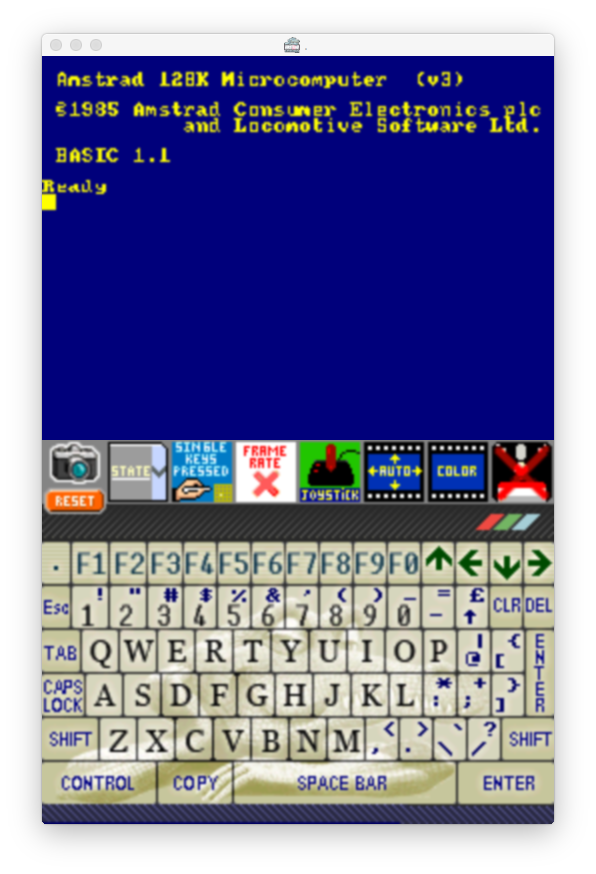

CrocoDS
=======

Amstrad emulator for Nintendo DS.

Based on Win-CPC by Ludovic Deplanque.

First version of CrocoDS was created for... Nintendo DS. 



How to install?
===============

- To run homebrews on your Nintendo DS, you need to buy a special DS cartridge (linker) to plug into your Nintendo DS game port. This cartridge is like a game cartridge except you insert a Flash card into it.
- First, connect the Flash card to your computer (using a Flash card reader) 
- Patch the .nds file with dldi if needed (http://chishm.drunkencoders.com/DLDI/)
- Copy the homebrew file (the .nds file) from the computer to the flash card. 
- Copy the .dsk (or .sna) file in the root (or in the /ROMS/CPC directory) of your flash card).
- Then, get the Flash card and insert it into the special cartridge (linker). 
- Finally, plug this cartridge into your DS. That's all. 
- Switch on your DS and you will see a menu with the name of the homebrew file you've just transfered. Select it to run.     

How to use?
===========
    
- Direction PAD & A/B: Joystick, keypad or keyboard emulation. 
- SELECT to display the setup menu.
- To load a ROM, just press 'Select' to display the menu. Select the game and play.

How to compile?
===============

To compile crocods
Modify ds_rules from

```
%.nds: %.arm9
    ndstool -c $@ -9 $<
    @echo built ... $(notdir $@)
```

TO

```
%.nds: %.arm9
    ndstool -c $@ -9 $< -7 $(ARM7BIN)
    @echo built ... $(notdir $@)
```


License
=======

CrocoDS Copyright (c) 2013 Miguel Vanhove, Kyuran

This program is free software: you can redistribute it and/or modify it under the terms of the GNU General Public License as published by the Free Software Foundation, either version 3 of the License, or (at your option) any later version.

This program is distributed in the hope that it will be useful, but WITHOUT ANY WARRANTY; without even the implied warranty of

MERCHANTABILITY or FITNESS FOR A PARTICULAR PURPOSE. See the GNU General Public License for more details.

You should have received a copy of the GNU General Public License along with this program. If not, see http://www.gnu.org/licenses/.

Copyright
=========
This Project is based upon the following work:

- [Win-CPC](http://demoniak-contrib.forumactif.com "Win-CPC"): Amstrad CPC Emulator - Copyright 2012 Ludovic Deplanque.
- [Caprice32](https://sourceforge.net/projects/caprice32/ "Caprice32"): Amstrad CPC Emulator - Copyright 1997-2004 Ulrich Doewich.
- GFX: Copyright 2007 Kukulcan.
- GFX (keyboard): Copyright 2013 Jean-Jacques Cortes


Specs
=====

Should run on:
any Nintendo DS with a decent linker that is supported by DLDI

History
=======

Version 2.0 (11-9-2007)

- Save-states (load, read & erase).
- New design. (thanks to kukulcan)
- Bugfixes with the autostart.
- Beter support of the copy, shift, control and caps-lock keys.
- Single / multi-keys pressed for activate cheat code.    
- Minor update in the Z80 emulation.
- Bugfixes in the timing of the sound module. (thanks to Alekmaul)
- All options are now available via icons.
- Screen capture (you need sna2png to convert the snapshot to bitmap)
- Speed limitator. (crocods is sometimes too fast)

Version 1.0 (1-12-2007)
  
- New keyboard 3/4.
- Resize of the automatic screen.
- More interlacing at the time posting of the screen.
- The scrolling of the screen (Via the key R) now also functions into horizontal.
- The sound is of better quality.
- Support of ROMs zippées functional.
- Support of the DLDI in order to be compatible with all old linkers and to come.
- the change of pallet is again possible for each line. (possible modification via the menu hack)
    
Version 0.5a (12-25-2006)
  
- Full mapping of keyboard.
- New menu.
- Load disk with or without autoload.
- Realtime for most of the games.
- Overscan screen display.
- Press R to scroll up / down the screen.
- Stereo sound. (pretty crappy)
- Roms can be stored in the root, ROMS or AMES directory.
- Zip roms suported. 
    
Version 0.4a (12-9-2006)
    
- Certain games did not function any more of with a bad interpretation of opcode HALT. It is now corrected.
- Addition of a menu allowing the posting of the framerate.

Version 0.3a (2006)
    
- Large increase in speed (real time on much of plays)
- New module CRT which brings the support of the overscan (Thank you Demoniak)
- Beginning of a design for the keyboard
- Finely of configuration (green monitor color)
- The sound functions (but there remains a problem of envelope of volume)     
	
   
Check updates on my blog "My Ketchup is Dead" at http://deadketchup.kyuran.be
Feel free to (e)mail us for anything..
